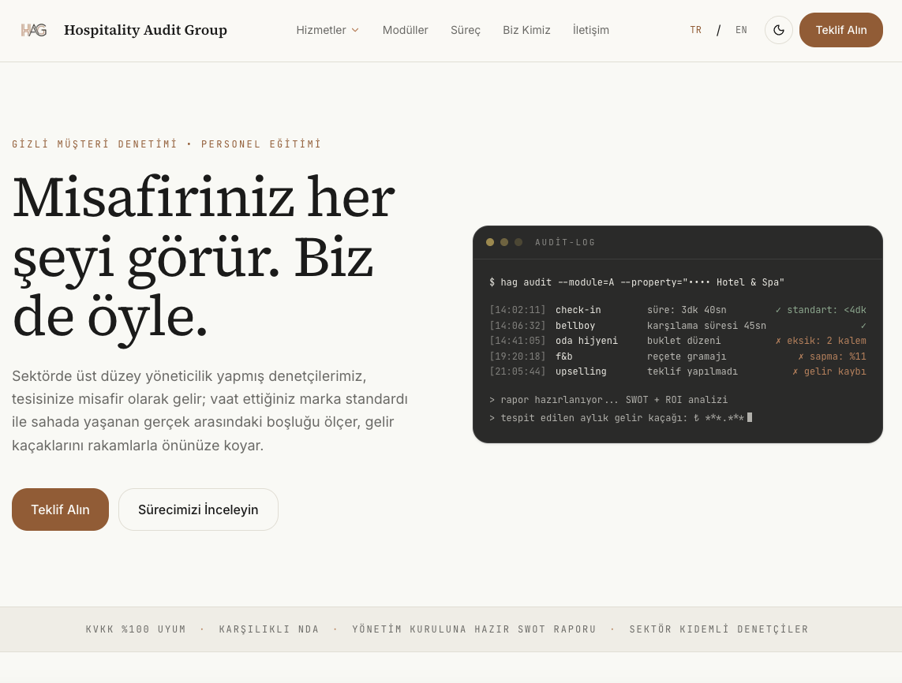
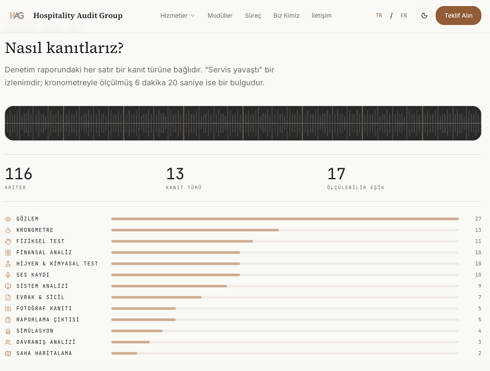
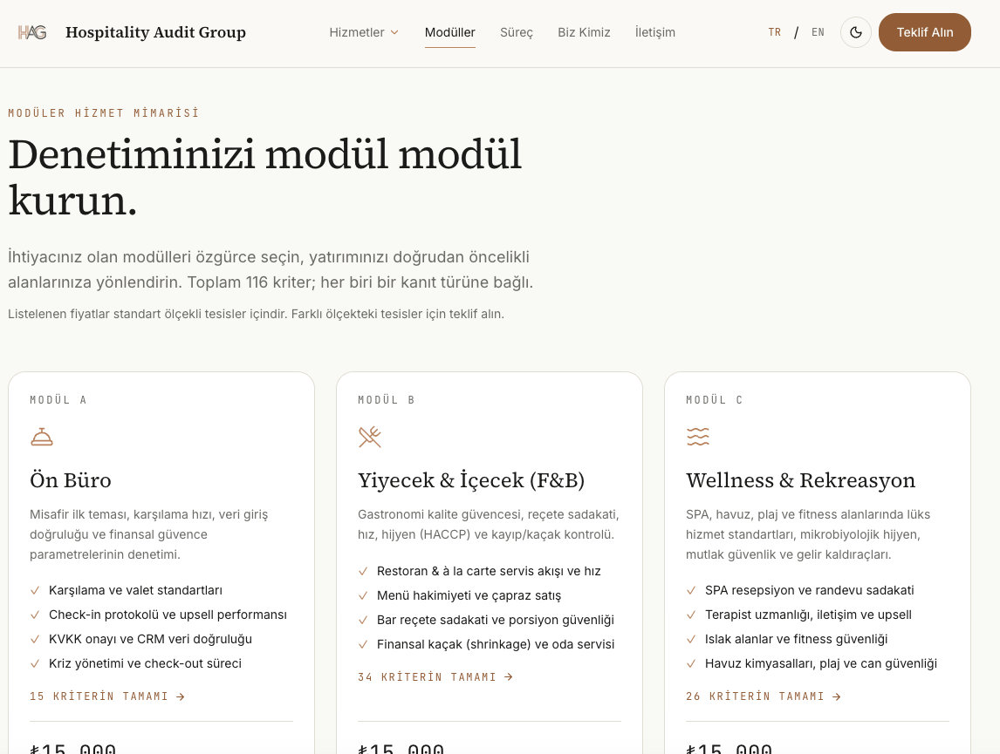
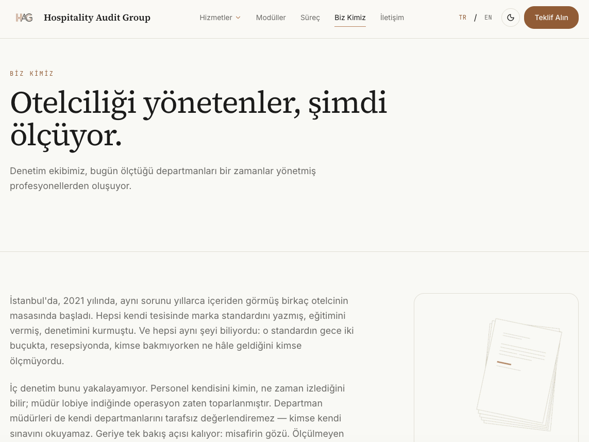

<div align="center">

# Hospitality Audit Group

**Marka Güvencesi ve Operasyonel Kaldıraç.**

Otellere gizli müşteri ziyaretiyle denetim ve personel eğitimi sunan
Hospitality Audit Group'un kurumsal web sitesi.

`Next.js 16` · `React 19` · `TypeScript` · `Tailwind CSS 4` · `Framer Motion`

</div>

---

## İçindekiler

- [Proje Nedir](#proje-nedir)
- [Tasarım Felsefesi](#tasarım-felsefesi)
- [Hızlı Başlangıç](#hızlı-başlangıç)
- [Mimari](#mimari)
- [Denetim Modülleri](#denetim-modülleri)
- [Denetim Metodolojisi](#denetim-metodolojisi)
- [Teklif Sepeti ve Fiyatlandırma](#teklif-sepeti-ve-fiyatlandırma)
- [Tema Sistemi](#tema-sistemi)
- [Erişilebilirlik](#erişilebilirlik)
- [Komutlar](#komutlar)
- [Ortam Değişkenleri](#ortam-değişkenleri)
- [Yayına Alma](#yayına-alma)
- [Katkı Kuralları](#katkı-kuralları)

---

## Proje Nedir

Bu bir tanıtım sitesi değil, bir **satış mimarisidir**.

Otel sahibi siteye girer, tesisinin hangi alanlarında denetim istediğini modül
modül seçer, sepetine ekler, fiyatı görür ve ya doğrudan öder ya da özel teklif
ister. Site bu kararı vermesi için gereken her şeyi önüne koyar: neyin
ölçüleceğini, hangi kanıtla ölçüleceğini ve hangi eşiğin geçilmesi gerektiğini.

Sitenin ticari kalbi `/moduller`; ikna kalbi ise denetim kriterlerinin ta
kendisi. Rakip denetim firmalarının hiçbiri metodolojisini açık etmez — bizim
farkımız bu.

### Neyi bilerek yapmıyoruz

Bu kararlar tesadüf değil, marka duruşu:

| Yapmıyoruz | Neden |
|---|---|
| Stok otel fotoğrafı | Her denetim sitesi lobi fotoğrafı kullanıyor. Görsel dilimiz tipografi ve soyut panel. |
| Müşteri logosu duvarı | Gizlilik satan bir firma müşterisini teşhir edemez. |
| Denetçi isim ve fotoğrafı | *"Denetçilerimizin yüzünü göremezsiniz. Misafirleriniz de göremiyor."* |
| Müşteri referansı | Doğrulanamayan övgü gürültüdür. Kanıt gösteriyoruz, övgü değil. |
| Fiyat gizleme | Fiyat görünür. Pazarlık isteyen teklif yolunu kullanır. |

---

## Tasarım Felsefesi

**"Kağıt + Terminal"** — iki tema, aynı sitenin iki yüzü.

- **Açık tema — Rapor Kağıdı.** Krem zemin, serif başlıklar, bol beyaz alan.
  Elinizde tuttuğunuz denetim raporu.
- **Koyu tema — Operasyon Terminali.** Antrasit zemin, mono log satırları.
  Sahadaki denetçinin ekranı.

Üç ilke:

1. **Kağıt + Terminal.** Rapor ve saha, aynı markanın iki hâli.
2. **Mono = kanıt dili.** Etiketler, istatistikler, modül kodları ve süre
   eşikleri JetBrains Mono ile yazılır. "Ölçülebilirlik" iddiasını tipografi
   taşır.
3. **Tek imza, gerisi disiplinli.** Görsel cesaret tek yerde harcanır:
   hero'daki **Denetim Terminali**. Diğer her şey sessiz, hizalı, ferah.

### İmza Öğe — Denetim Terminali

Ana sayfa hero'sunda satır satır akan, tema-duyarlı sahte-canlı denetim logu:

```
$ hag audit --module=A --property="•••• Hotel & Spa"

[14:02:11] check-in       süre: 3dk 40sn        ✓ standart: <4dk
[14:41:05] oda hijyeni    buklet düzeni         ✗ eksik: 2 kalem
[19:20:18] f&b            reçete gramajı        ✗ sapma: %11
```

Panel her iki temada da koyu kalır — çünkü o rapor değil, **saha**.
`prefers-reduced-motion` açıkken animasyon çalışmaz, liste statik ve tam gösterilir.

---

## Site Görünümleri

Aşağıdaki ekran görüntüleri, sitenin sunduğu çift temalı kurumsal deneyimi ve modül yapısını yansıtmaktadır:

<div align="center">


<br/><br/>


</div>

---

## Hızlı Başlangıç

```bash
npm install
cp .env.example .env.local    # anahtarlar opsiyonel — aşağıya bakın
npm run dev
```

`http://localhost:3000`

> **Anahtarsız da çalışır.** `RESEND_API_KEY` yoksa teklif formu payload'u
> konsola loglar ve yine başarı döner — site demo ortamında kırılmaz.
> Ödeme yolu ise anahtar yokken **tamamen gizlenir** (aşağıda: [Ortam
> Değişkenleri](#ortam-değişkenleri)).

---

## Mimari

```
├── app/
│   ├── layout.tsx              fontlar, tema, metadata, Header/Footer
│   ├── page.tsx                ana sayfa
│   ├── globals.css             TEMA TOKENLARI — tek renk kaynağı
│   ├── moduller/
│   │   ├── page.tsx            katalog + sepet
│   │   └── [slug]/             modül detay + tam kriter listesi
│   ├── hizmetler/              gizli müşteri denetimi · personel eğitimi
│   ├── biz-kimiz/              kurumsal
│   ├── teklif/                 sepet + ödeme/teklif yolu
│   ├── api/teklif/             form → e-posta (Resend)
│   └── ...                     surec · iletisim · kvkk · yasal sayfalar
├── components/
│   ├── ui/                     Button · Card · Eyebrow · SectionHeading · Reveal · Logo
│   ├── layout/                 Header · Footer · ThemeToggle · MobileNav
│   ├── home/                   Hero · AuditTerminal · ProcessSection · ...
│   ├── modules/                ModuleCard · sepet bileşenleri
│   └── forms/                  QuoteForm · ContactForm
├── lib/                        ← İŞ MANTIĞI BURADA
└── scripts/check-links.mjs     tüm iç linkleri doğrular
```

### `lib/` — tek gerçek kaynağı

Sitenin tüm iş mantığı burada, bileşenlerden ayrık. Hiçbir bileşen fiyat, renk
veya kriter metni gömmez.

| Dosya | Sorumluluk |
|---|---|
| `modules-data.ts` | Modüller, fiyatlar, paket kapsamı. **Fiyatın tek kaynağı.** |
| `criteria/types.ts` | Kanıt kategorileri ve kriter tipleri |
| `criteria/module-{a..e}.ts` | Saha kılavuzlarından birebir transkripsiyon |
| `audit-criteria.ts` | Toplayıcı + istatistik fonksiyonları |
| `cart-math.ts` | Sepet aritmetiği — saf, test edilmiş |
| `quote-cart.ts` | Sepet store'u (`useSyncExternalStore`) |
| `quote-schema.ts` | Form sözleşmesi — client ve server aynı dosyayı kullanır |
| `company-data.ts` | Şirket bilgileri + placeholder koruması |
| `site-config.ts` | Nav, iletişim, route listesi |

**Neden bu ayrım önemli:** `sitemap.ts` ve `check-links.mjs` route listesini
`site-config.ts`'ten okur. Yeni sayfa eklerken tek yeri güncellersiniz, sitemap
ve link kontrolü otomatik takip eder.

---

## Denetim Modülleri

Modül harflendirmesi **saha kılavuzlarını** takip eder. Kılavuzlar kendi içinde
çapraz referanslıdır (`D.2.3` → *"Kat Hizmetleri (Modül E)"*), bu yüzden E =
Kat Hizmetleri ve 360° = A+B+C+E.

| Kod | Modül | Kapsam |
|:---:|---|---|
| **A** | Ön Büro | Karşılama, check-in, upsell, kriz, check-out |
| **B** | Yiyecek & İçecek | Servis akışı, reçete sadakati, bar, finansal kaçak |
| **C** | Wellness & Rekreasyon | SPA, terapist, ıslak alan, havuz, plaj, can güvenliği |
| **E** | Kat Hizmetleri & Oda İçi | Duyusal etki, tekstil, banyo, balkon, kitchenette |
| **D** | 360° Tam Denetim | **A + B + C + E** + departman sinerjisi + SWOT + TNA |
| — | Personel Eğitimi | Harfsiz hizmet. Denetim değil, eğitim. D'deki TNA'dan beslenir. |

---

## Denetim Metodolojisi

Sitenin en güçlü içerik varlığı. Rakamlar **elle yazılmaz** —
`audit-criteria.ts`'ten türetilir, yani iddia metodolojiden ayrı düşemez.

<div align="center">

| | |
|---:|:---|
| **112** | kriter |
| **13** | kanıt kategorisi |
| **17** | ölçülebilir eşik |
| **5** | perspektif anlatısı |

</div>

### Kanıt dağılımı

```
gozlem          ████████████████████████░  25
kronometre      █████████████░             13
fizikselTest    ███████████░               11
finansal        ██████████░                10
hijyenTesti     ██████████░                10
sesKaydi        ██████████░                10
sistemAnalizi   ████████░                   8
evrak           ███████░                    7
raporlama       █████░                      5
fotograf        ████░                       4
simulasyon      ████░                       4
davranis        ███░                        3
sahaHaritalama  ██░                         2
```

### Kanıt türü nedir

Her kriter bir **kanıt türüne** bağlıdır. "İyi hizmet vermiyorlar" demeyiz;
şunu deriz:

> **A.2.2** — Check-in süreci (kimlik alımından kart teslimine) maksimum
> **4 dakikada** tamamlandı mı? → *Kanıt: Kronometre*

Kılavuzlar kanıt türlerini serbest metinle yazmış ve aynı yöntem birden çok
adla geçiyor (`UV Işık Testi`, `UV Light Testi`, `UV & Gözlem`, `Koku & UV Testi`
— hepsi aynı yöntem). Bu yüzden her kriter iki alan taşır:

- `evidenceLabel` — kılavuzun **birebir** yazdığı etiket, korunur
- `evidence` — kanonik kategori, ikon ve istatistik için kullanılır

Sadakat kaybolmadan tutarlılık sağlanır.

### Örnek eşikler

| Kod | Eşik |
|---|---|
| `A.1.1` | Araç kapıya yanaştıktan sonra **60 saniye** içinde karşılama |
| `A.2.2` | Check-in **maksimum 4 dakika** |
| `B.1.2.4` | Başlangıçlar **10.**, ana yemekler en geç **20. dakikada** |
| `B.3.3.3` | Oda servisi sıcak yemek **maksimum 30 dk** |
| `C.4.1.1` | Havuz **pH 7.2 – 7.6** · **Klor 1.0 – 3.0 ppm** |
| `D.3.3` | Sağlık krizinde yönetim zinciri **ilk 120 saniyede** aktif |
| `E.1.2` | Oda iklimlendirme **22°C** standardı |

---

## Teklif Sepeti ve Fiyatlandırma

### Fiyatlar

Tüm fiyatlar **KDV dahildir**. Tek kaynak: `lib/modules-data.ts`.

| Modül | Fiyat |
|---|---:|
| A · B · C · E (her biri) | 15.000 TL |
| **D — 360° Tam Denetim** | **50.000 TL** |
| Personel Eğitimi | 15.000 TL |

### Paket mantığı

D, A+B+C+E kapsar. Ayrı ayrı alınsa 60.000 TL — paket 50.000 TL.

Sepet bunu bilir ve **tek bir akıllı davranış** sergiler:

- A, B, C ve E birlikte seçiliyse → *"D paketi 10.000 TL ucuz"* önerisi çıkar.
  **Öneri sunar, kendiliğinden değiştirmez.**
- D sepetteyken A/B/C/E kartları kilitlenir + `D paketine dahil` rozeti alır.
  Aynı şeyi iki kez satmak yanlış.
- Personel Eğitimi D'ye dahil **değildir** — D varken de eklenebilir.

### KDV neden gross üzerinden bölünür

Fiyatlar KDV dahil listelenir, bu yüzden ayrıştırma **toplam üzerinden tek
seferde** yapılır:

```ts
const net = Math.round(total / (1 + VAT_RATE));
const vat = total - net;
```

Her satırı ayrı bölüp toplasaydık, kuruş yuvarlamaları birikir ve toplam,
alıcının az önce okuduğu liste fiyatlarıyla tutmazdı.

Bu, 64 olası sepet kombinasyonunun **tamamı** için test edilir:

```bash
npm test
```

---

## Tema Sistemi

Tailwind CSS **v4** — CSS-first. `tailwind.config.ts` **yoktur**.

```css
/* app/globals.css */
@custom-variant dark (&:where(.dark, .dark *));

:root { --bg: #faf9f5; --accent: #d97757; ... }
.dark { --bg: #1f1e1d; ... }

@theme inline {          /* inline ŞART — yoksa .dark geçişi çalışmaz */
  --color-bg: var(--bg);
  --color-accent: var(--accent);
}
```

**Yeni token eklerken:** önce `:root` ve `.dark`'a ham değer, sonra
`@theme inline`'a eşleme.

### İki katmanlı accent — dikkat

`#D97757` marka terracotta'sı krem zeminde **2.96:1** kontrast verir. AA eşiği
4.5:1. Bu yüzden accent ikiye ayrılmıştır:

| Token | Kullanım |
|---|---|
| `--accent` `#D97757` | **Yalnızca dekoratif.** Kenarlık, ikon, ayraç, terminaldeki `✗`. **Asla metin taşımaz.** |
| `--accent-strong` | Accent renkli **metin** ve **buton dolgusu**. Açık: `#B04E2C` · Koyu: `#E28A6D` |
| `--accent-strong-ink` | Buton dolgusu üstündeki metin rengi |

Yani eyebrow'lar `text-accent-strong`, `text-accent` **değil**.

Ölçülen oranlar `globals.css` içinde yorum olarak yazılıdır. Palet değişirse
yeniden ölçülmeli.

---

## Erişilebilirlik

- Her sayfada tek `<h1>`, sıralı başlık hiyerarşisi
- Tüm metin/zemin çiftleri **WCAG AA** (4.5:1) — ölçülmüş, `globals.css`'te belgeli
- Tek focus halkası (`:focus-visible`), tüm site klavyeyle gezilebilir
- MobileNav: focus trap + `Esc` + odak geri dönüşü
- `prefers-reduced-motion`: terminal statik, `Reveal` animasyonsuz, stagger yok
- Form hataları `aria-describedby` ile alana bağlı, `aria-invalid` işaretli
- 375px'te taşma yok

---

## Komutlar

| Komut | Ne yapar |
|---|---|
| `npm run dev` | Geliştirme sunucusu |
| `npm run build` | Production build |
| `npm start` | Production sunucusu |
| `npm test` | Sepet matematiği testleri (vitest) |
| `npm run lint` | ESLint (flat config) |
| `npm run typecheck` | `tsc --noEmit` |
| `npm run check-links` | Tüm iç linkleri fetch eder, 200 döndüğünü doğrular |

> `next lint` Next 16'da kaldırıldı. Lint script'i `eslint .`, config
> `eslint.config.mjs` (flat config).

### Link kontrolü

```bash
npm run build && npx next start -p 3000 &
npm run check-links
```

Route listesini `site-config.ts`'ten okur, her sayfayı fetch eder, HTML'deki
tüm iç `href`'leri toplar, hepsinin 200 döndüğünü doğrular, olmayan bir path'in
404 verdiğini teyit eder. Kırık link varsa **non-zero exit** — CI'da sessizce
geçmez.

---

## Ortam Değişkenleri

```bash
# .env.local  — ASLA commit edilmez
RESEND_API_KEY=            # boşsa: form payload'u loglar, yine 200 döner
CONTACT_EMAIL=corporate@hospitalityauditgroup.com

IYZICO_API_KEY=            # boşsa: ödeme yolu TAMAMEN gizlenir
IYZICO_SECRET_KEY=
IYZICO_BASE_URL=https://sandbox-api.iyzipay.com
```

### İki farklı fallback felsefesi — karıştırmayın

| | Anahtar yoksa | Neden |
|---|---|---|
| **Teklif formu** | Loglar, **200 döner** | Kimse para kaybetmez. Site demoda çalışır kalır. |
| **Ödeme** | Yol **tamamen gizlenir** | Ödemede sahte başarı **asla** dönmez. Para söz konusuysa belirsizlik olmaz. |

Bu ayrım koda yorum olarak sabitlenmiştir. Değiştirmeyin.

---

## Yayına Alma

Vercel. Kontrol listesi:

- [ ] `npm run build` sıfır hata (TS strict)
- [ ] `npm test` geçiyor
- [ ] `npm audit` temiz
- [ ] Env değişkenleri Vercel dashboard'da — `RESEND_API_KEY` client bundle'a sızmıyor
- [ ] `site-config.ts` → `url` gerçek alan adına çevrildi
- [ ] **`company-data.ts` → `isPlaceholder: false`**
- [ ] Resend'de alan adı doğrulaması (SPF/DKIM) yapıldı
- [ ] ETBİS kaydı tamam (kart tahsilatı için zorunlu)
- [ ] Yasal metinler hukukçu onayından geçti

> ⚠️ **`isPlaceholder: true` iken yayına almayın.** "Biz Kimiz" sayfasındaki
> kuruluş öyküsü ve kadro rakamları geçici içeriktir. Detaylar:
> [`docs/senin-yapacaklarin.md`](./docs/senin-yapacaklarin.md)

---

## Katkı Kuralları

Ayrıntı: [`CLAUDE.md`](./CLAUDE.md)

- Yorumlar ve kod **İngilizce**; "ne"yi değil **"neden"i** açıklar
- TypeScript strict — `any` yasak, `@ts-ignore` yasak, `eslint-disable` yasak
- Hardcoded hex **yalnızca** `globals.css` ve `tokens.ts`'te
- Site içeriği **Türkçe**, kriter metinleri saha kılavuzlarından **birebir** —
  yazım hatası bile düzeltilmez, kaynağa sadakat esastır
- Hata yutulmaz. Fallback yalnızca açıkça tasarlanmış yerlerde ve yorumlu

### Belgeler

| Dosya | İçerik |
|---|---|
| [`CLAUDE.md`](./CLAUDE.md) | Çalışma kuralları + blueprint'ten onaylı sapmalar |
| [`docs/senin-yapacaklarin.md`](./docs/senin-yapacaklarin.md) | Manuel işler: iyzico, ETBİS, sicil bilgileri, hukukçu |
| [`docs/gorsel-promptlari.md`](./docs/gorsel-promptlari.md) | Görsel üretim promptları + marka paleti |
| [`docs/blueprint-v1.md`](./docs/blueprint-v1.md) | v1 tasarım dokümanı |
| [`docs/superpowers/specs/`](./docs/superpowers/specs/) | v2 tasarım dokümanı |

---

<div align="center">
<sub>

`HOSPITALITY AUDIT GROUP © 2026`

</sub>
</div>
