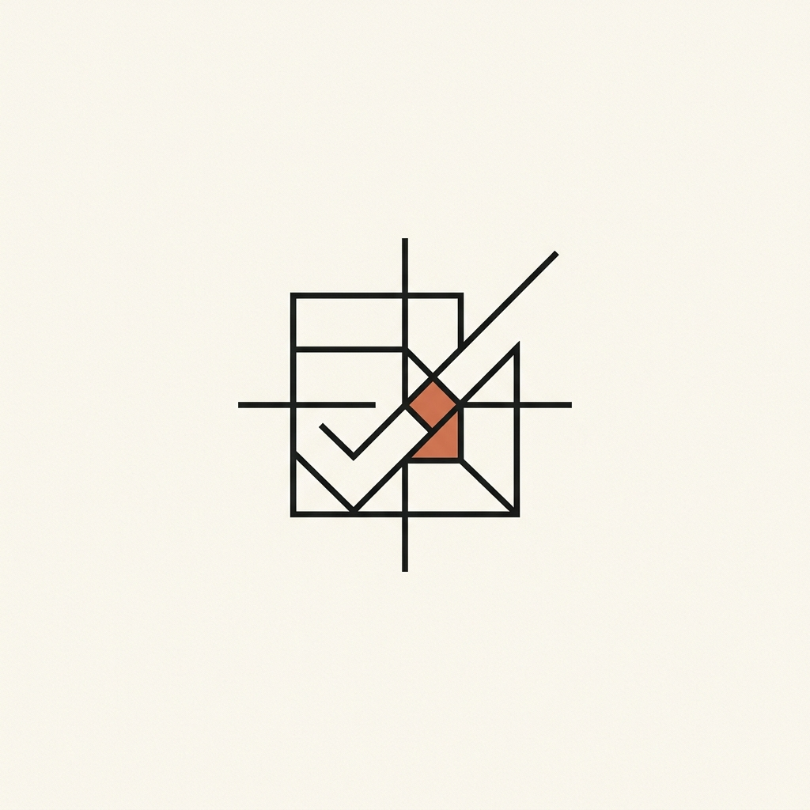

<div align="center">



# Hospitality Audit Group

**Marka güvencesi ve operasyonel kaldıraç.**

Otellere gizli müşteri denetimi ve personel eğitimi sunan
Hospitality Audit Group'un kurumsal web sitesi.

<sub>`Next.js 16` · `React 19` · `TypeScript` · `Tailwind CSS 4` · `Framer Motion`</sub>

<br/>


</div>

---

## Proje

Bu bir tanıtım sitesi değil, bir **satış mimarisi**. Otel sahibi girer, tesisinin
hangi alanlarında denetim istediğini modül modül seçer, sepete ekler, fiyatı
görür — ya doğrudan öder ya da özel teklif ister.

Ticari kalp `/moduller`. İkna kalbi ise denetim kriterlerinin kendisi: neyin,
hangi kanıtla, hangi eşikte ölçüldüğü. Rakiplerin gizlediği metodolojiyi
açık ederiz.

**Bilerek yapmadıklarımız** — stok otel fotoğrafı yok, müşteri logosu duvarı yok,
denetçi yüzü yok, doğrulanamayan referans yok, gizli fiyat yok. Her biri marka
duruşu: gizlilik satan firma müşterisini teşhir edemez, kanıt gösteririz övgü değil.

---

## Tasarım

**"Kağıt + Terminal"** — iki tema, aynı sitenin iki yüzü.

- **Açık — Rapor Kağıdı.** Krem zemin, serif başlıklar, bol beyaz alan. Elinizdeki denetim raporu.
- **Koyu — Operasyon Terminali.** Antrasit zemin, mono log satırları. Sahadaki denetçinin ekranı.

Görsel cesaret tek yerde harcanır: hero'daki **Denetim Terminali** — satır satır
akan, tema-duyarlı sahte-canlı log. Gerisi sessiz, hizalı, ferah.

```
$ hag audit --module=A --property="•••• Hotel & Spa"

[14:02:11] check-in       süre: 3dk 40sn        ✓ standart: <4dk
[14:41:05] oda hijyeni    buklet düzeni         ✗ eksik: 2 kalem
[19:20:18] f&b            reçete gramajı        ✗ sapma: %11
```

`prefers-reduced-motion` açıkken animasyon durur, liste statik ve tam gösterilir.

---

## Görünümler

<div align="center">


<br/><br/>

</div>

---

## Hızlı Başlangıç

```bash
npm install
cp .env.example .env.local    # anahtarlar opsiyonel
npm run dev                   # http://localhost:3000
```

> **Anahtarsız çalışır.** `RESEND_API_KEY` yoksa teklif formu payload'u loglar,
> yine 200 döner. Ödeme yolu anahtar yokken **tamamen gizlenir** — sahte başarı asla dönmez.

---

## Mimari

```
app/          sayfalar · globals.css (tek renk kaynağı) · api/
components/   ui · layout · home · modules · forms
lib/          ← İŞ MANTIĞI: fiyat, kriter, sepet, sözleşme
scripts/      check-links.mjs — tüm iç linkleri doğrular
```

Tüm iş mantığı `lib/`'te, bileşenlerden ayrık. Hiçbir bileşen fiyat, renk veya
kriter metni gömmez.

| Dosya | Sorumluluk |
|---|---|
| `modules-data.ts` | Modüller, fiyatlar, kapsam — **fiyatın tek kaynağı** |
| `criteria/*` | Saha kılavuzlarından birebir kriter transkripsiyonu |
| `cart-math.ts` | Sepet aritmetiği — saf, test edilmiş |
| `quote-cart.ts` | Sepet store'u (`useSyncExternalStore`) |
| `site-config.ts` | Nav, iletişim, route listesi — sitemap ve link kontrolü buradan okur |

---

## Denetim Modülleri

Harflendirme **saha kılavuzlarını** takip eder — bu yüzden E = Kat Hizmetleri,
360° = A+B+C+E.

| Kod | Modül | Fiyat |
|:---:|---|---:|
| **A** | Ön Büro — karşılama, check-in, upsell, kriz | 15.000 TL |
| **B** | Yiyecek & İçecek — servis, reçete, bar, kaçak | 15.000 TL |
| **C** | Wellness & Rekreasyon — SPA, ıslak alan, can güvenliği | 15.000 TL |
| **E** | Kat Hizmetleri & Oda İçi — tekstil, banyo, balkon | 15.000 TL |
| **D** | **360° Tam Denetim** — A+B+C+E + sinerji + SWOT + TNA | **50.000 TL** |
| — | Personel Eğitimi — denetim değil, eğitim | 15.000 TL |

Fiyatlar **KDV dahil**. Tek kaynak `lib/modules-data.ts`. D paketi A+B+C+E'yi
kapsar: ayrı ayrı 60.000 TL, paket 50.000 TL. Sepet bunu bilir — dördü seçiliyse
D önerir, D sepetteyken diğerlerini kilitler. **Önerir, kendiliğinden değiştirmez.**

---

## Metodoloji

İçeriğin en güçlü varlığı. Rakamlar elle yazılmaz — `audit-criteria.ts`'ten
türetilir, iddia metodolojiden ayrı düşemez.

<div align="center">

**112** kriter · **13** kanıt kategorisi · **17** ölçülebilir eşik · **5** perspektif

</div>

Her kriter bir **kanıt türüne** bağlıdır. "İyi hizmet vermiyorlar" demeyiz:

> **A.2.2** — Check-in (kimlik alımından kart teslimine) maksimum **4 dakikada**
> tamamlandı mı? → *Kanıt: Kronometre*

Örnek eşikler: araç yanaştıktan sonra karşılama **60 sn** · oda servisi sıcak
yemek **max 30 dk** · havuz **pH 7.2–7.6, klor 1.0–3.0 ppm** · sağlık krizinde
yönetim zinciri **ilk 120 sn**.

---

## Tema Sistemi

Tailwind CSS **v4**, CSS-first — `tailwind.config.ts` **yoktur**. Tema
`app/globals.css` içinde: `:root` / `.dark` ham değeri tutar, `@theme inline`
Tailwind utility'lerine bağlar (`inline` şart — yoksa `.dark` geçişi çalışmaz).

Accent iki katmanlı — `#D97757` krem zeminde 2.96:1, AA'yı geçmez:

| Token | Kullanım |
|---|---|
| `--accent` | **Yalnızca dekoratif** — kenarlık, ikon, terminal `✗`. Asla metin taşımaz. |
| `--accent-strong` | Accent renkli **metin** ve **buton dolgusu** (açık `#B04E2C` · koyu `#E28A6D`) |

Tüm metin/zemin çiftleri **WCAG AA** (4.5:1), ölçülmüş ve `globals.css`'te belgeli.

---

## Komutlar

| Komut | Ne yapar |
|---|---|
| `npm run dev` | Geliştirme sunucusu |
| `npm run build` | Production build |
| `npm test` | Sepet matematiği testleri (vitest) |
| `npm run lint` | ESLint (flat config) |
| `npm run typecheck` | `tsc --noEmit` |
| `npm run check-links` | Tüm iç linkleri fetch eder, 200 döndüğünü doğrular |

---

## Yayına Alma

Vercel. Yayın öncesi:

- [ ] `npm run build` · `npm test` · `npm audit` temiz
- [ ] Env değişkenleri Vercel dashboard'da — `RESEND_API_KEY` client bundle'a sızmıyor
- [ ] `site-config.ts` → `url` gerçek alan adı · `company-data.ts` → `isPlaceholder: false`
- [ ] Resend alan doğrulaması (SPF/DKIM) · ETBİS kaydı · yasal metin hukukçu onayı

> ⚠️ **`isPlaceholder: true` iken yayına almayın** — "Biz Kimiz" içeriği geçicidir.
> Manuel işler: [`docs/senin-yapacaklarin.md`](./docs/senin-yapacaklarin.md)

---

## Katkı Kuralları

- Yorumlar ve kod **İngilizce**; "ne"yi değil **"neden"i** açıklar
- TypeScript strict — `any`, `@ts-ignore`, `eslint-disable` yasak
- Hardcoded hex **yalnızca** `globals.css` ve `tokens.ts`'te
- Kriter metinleri saha kılavuzlarından **birebir** — yazım hatası bile düzeltilmez
- Hata yutulmaz; fallback yalnızca açıkça tasarlanmış yerlerde ve yorumlu

Ayrıntı: [`CLAUDE.md`](./CLAUDE.md)

---

<div align="center">
<sub>

`HOSPITALITY AUDIT GROUP © 2026`

</sub>
</div>
